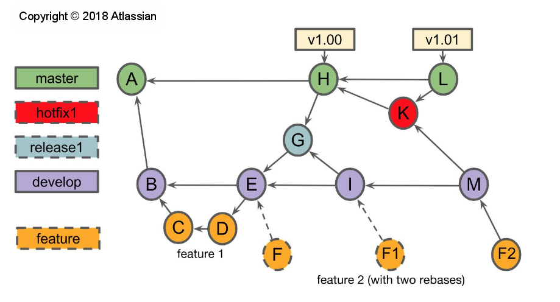

Trend framework
===============

This is a private repository intended for development of the 'trends and their limits' framework from Oct 2018 within the C3S_511 project.

In the first stage, the diagnostics will be tested on one dimensional data (either station data, or a single gridpoint extracted from a gridded dataset). This allows for the development of robust diagnostics that can later be applied to gridded data. The folder test_data contains a file with 2m temperature from the station 'De Bilt' in the Netherlands. This timeseries is relatively long and is homogenized.

The file _c3s_511_trends.py_ contains the class TrendLims1D in which different diagnostics are implemented, and more will be implemented in the future. The files with the extension `.ipynb` are Jupyter notebook files and serve as examples for using the framework. For users who have no experience with the Jupyter notebook, it is recommended to read sections 1.1 and 3 from [this tutorial](https://jupyter-notebook-beginner-guide.readthedocs.io/en/latest/what_is_jupyter.html#notebook-document).

Installation [NEW]
===================

### Clone this repository
Navigate to the directory where you want the software to be installed and clone the master branch of this repository.

### Create a new environment and install the R packages
Navigate to the 'install' directory and run the following from a terminal: 
`conda env create -f environment.yml`

The above command might take a while. When it is finished, the required R packages can be installed. Edit the first and second line in the file `installR.r` to point to the right directories for your installation and run from a terminal:
`./installR.r`

### Check the installation
Start the Jupyter notebook with the command `jupyter-notebook`. Open the notebook 'examples_general.ipynb' and run all cells in this notebook to see if the installation was succesfull. 

Trends and their limits evaluator guidance 
===========================================

https://docs.google.com/document/d/1YbG07gdIMjLJmV8zHVy55daJbctNjsZUGNZFSxCuQ0w/edit#

Contributing
=============

# Usefull material
- ATBD document from ECA&D: https://www.ecad.eu/documents/atbd.pdf
- R-package trend documentation: https://cran.r-project.org/web/packages/trend/vignettes/trend.pdf
- R-package iki.dataclim documentation: https://cran.r-project.org/web/packages/iki.dataclim/iki.dataclim.pdf
- Testing the assumptions of linear regression: http://people.duke.edu/~rnau/testing.htm
- Understanding Q-Q Plots: https://data.library.virginia.edu/understanding-q-q-plots/
- Mann-Kendall test  https://vsp.pnnl.gov/help/vsample/design_trend_mann_kendall.htm
